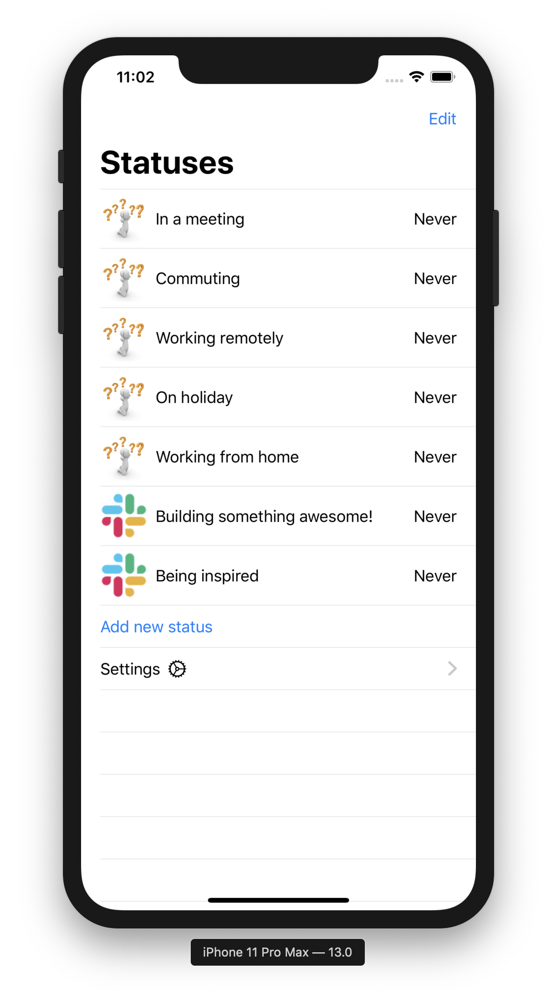

# Slack Status Setter

You can use this project to quickly change your slack status from a list of  statuses.

It is very rough around the errors, as you will need to create a Slack App and install it in your workspace.
Then you can get your API token.

## Screenshot

This is a work in progress. If you'd like to help, then any help would be appreciated.

## Current Features

* Default Slack statues (hardcoded)
* Add / Edit statuses
* Click to set status

## Missing Features

* Login to slack (currently have to paste in a api token)
* Show standard slack emojis
* Better organised userinterface
* Image picker
* Caching
* Read workspace default statues
* No message on error

## Licence

See [license](LICENSE.md) file.
